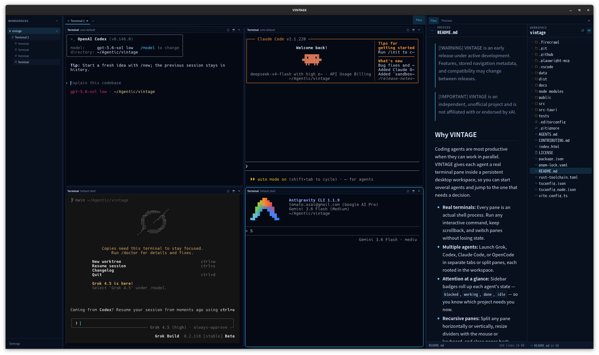

<h1 align="center">
  
</h1>

<p align="center">
  <strong>Visual Interface for Terminal Agents.</strong><br>
  An open-source multi-agent desktop workspace.
</p>

<p align="center">
  Run Grok, Codex, Claude Code, and OpenCode side by side in real terminal panes, and follow every agent's progress from one place.
</p>

<p align="center">
  <a href="#install-vintage">Install</a> ·
  <a href="#what-works-today">Features</a> ·
  <a href="#getting-started">Getting started</a> ·
  <a href="#development">Development</a> ·
  <a href="CONTRIBUTING.md">Contributing</a>
</p>

> [!WARNING]
> VINTAGE is an early release under active development. Features, stored navigation metadata, and compatibility may change between releases.

> [!IMPORTANT]
> VINTAGE is an independent, unofficial project and is not affiliated with or endorsed by xAI.

<p align="center">
  <strong><a href="https://github.com/Tomatio13/vintage/releases/latest">Download the latest release</a></strong>
</p>

## Why VINTAGE

Coding agents are most productive when they can work in parallel. VINTAGE gives each agent a real terminal pane inside a persistent desktop workspace, so you can start several agents and jump to the one that needs a decision.

- **Real terminals:** Every pane is an actual shell process. Run any interactive command, keep scrollback, and switch panes without losing state.
- **Multiple agents:** Launch Grok, Codex, Claude Code, or OpenCode in separate tabs or split panes, each rooted in the workspace.
- **Attention at a glance:** Sidebar badges roll up each agent's state — `blocked`, `working`, `done`, `idle` — so you know which project needs you now.
- **Recursive panes:** Split any pane horizontally or vertically, resize dividers with the mouse or keyboard, and close panes back down.
- **Workspace files:** Browse and preview files on the right, watching the workspace for changes.
- **Session identity:** Hooks and plugins report native session ids, so a stopped pane can be restarted into the same session when the CLI supports it.
- **Restart-safe:** Quit and reopen — placement is restored; processes are not silently relaunched.
- **Native desktop host:** Process and filesystem access stay behind typed Tauri commands in the Rust host.




## What works today

| Area | Current support |
| --- | --- |
| Workspaces | Registered project folders are the trust source for every terminal and file operation; unregistering stops processes and watchers but never deletes files |
| Terminals | Interactive shell panes with tabs, recursive horizontal/vertical splits, divider resize, restart, and close |
| Shells | PowerShell 5.1 / 7, Git Bash, Ubuntu default shell, Bash, Zsh, and validated custom executables |
| Agents | Grok, Codex, Claude Code, and OpenCode presets plus arbitrary custom programs; each runs inside a shell and returns to it when it exits |
| Activity | Screen-manifest detection (Herdr-ported) plus hook/plugin reporting with session identity; sidebar badges roll up to the workspace |
| Restart | A stopped pane can restart into a fresh shell or resume the previous native session (`codex resume`, `claude --resume`, `opencode --session`) |
| Workspace files | Live file tree with hidden-file controls, system file-manager actions, and syntax-highlighted text, image, PDF, and font previews |
| Layout | Placement persists to `workspace-layouts.json`; damaged files stop autosave and offer a back-up-and-reset flow |
| Updates | Signed in-app updates backed by GitHub Releases |

## Install VINTAGE

VINTAGE runs each agent CLI directly on your computer. Install the CLIs you want to use (Grok, Codex, Claude Code, OpenCode), then choose the VINTAGE package for your operating system. VINTAGE detects the CLIs on your `PATH`; launching an undetected CLI still works if it is added to `PATH` after your profile loads.

### 1. Install agent CLIs

Install any of the supported agents with their official installers and confirm they are on `PATH`:

```bash
grok --version      # Grok Build
codex --version     # OpenAI Codex
claude --version    # Claude Code
opencode --version  # OpenCode
```

VINTAGE does not bundle or sign in to the agents on your behalf; each CLI owns its own authentication.

### 2. Download VINTAGE

Download VINTAGE only from the official [GitHub Releases page](https://github.com/Tomatio13/vintage/releases/latest). Expand **Assets** and select the package that matches your computer:

| Operating system | Package to download | Architecture |
| --- | --- | --- |
| macOS on Apple Silicon | `VINTAGE_*_aarch64.dmg` | Apple M1 or later |
| macOS on Intel | `VINTAGE_*_x64.dmg` | Intel 64-bit |
| Windows | `VINTAGE_*_x64-setup.exe` | x86-64 |
| Debian or Ubuntu | `VINTAGE_*_amd64.deb` | x86-64 |
| Other Linux distributions | `VINTAGE_*_amd64.AppImage` | x86-64 |

#### macOS

Open the `.dmg`, then drag **VINTAGE** into the **Applications** folder. macOS release builds are code signed and notarized by Apple.

#### Windows

Run `VINTAGE_*_x64-setup.exe` and follow the installer. The Windows installer is signed for VINTAGE's in-app updater, but it is not yet Authenticode code signed, so Windows SmartScreen may show an unrecognized-publisher warning. Confirm that the file came from `github.com/Tomatio13/vintage` before continuing.

#### Debian or Ubuntu

```bash
sudo apt install ./VINTAGE_*_amd64.deb
```

#### Other Linux distributions

Make the AppImage executable, then run it:

```bash
chmod +x VINTAGE_*_amd64.AppImage
./VINTAGE_*_amd64.AppImage
```

Files ending in `.sig`, `.app.tar.gz`, and `latest.json` are used by the signed automatic updater. You do not need to download them for a manual installation.

## Getting started

Start VINTAGE from your Applications folder, Start menu, or application launcher.

1. **Open a workspace** with the + button in the sidebar, or pick an existing folder. The workspace becomes the trust root for every terminal and file operation.
1. **Start a terminal** in a pane. A new tab starts with your default shell; each pane can be split horizontally or vertically.
1. **Launch an agent** from a pane's controls, or just type its command into the shell directly (`codex`, `claude`, `opencode`, `grok`).
1. **Watch the sidebar** — badges roll each pane up to its tab and workspace, so a blocked agent is visible from the tree.
1. **Preview files** with the **Files** toggle on the right, and open folders in your system file manager.

Useful keyboard controls:

- <kbd>Arrow</kbd> keys on a divider resize it; <kbd>Home</kbd>/<kbd>End</kbd> jump to the extremes; <kbd>Shift</kbd> makes the step finer.
- The workspace sidebar lists workspaces → tabs → panes, with attention badges on each row.
- Closing a pane, tab, or workspace stops its PTY first, then removes the placement.

When you quit VINTAGE, every PTY, child process, file watcher, and hook IPC connection is stopped. Only the placement is saved; processes are never silently relaunched.

## How it works

```text
React renderer
      │ typed Tauri commands and events
      ▼
Tauri Rust host
      │ PTY + hook IPC environment
      ▼
Shell process running the agent CLI
```

The React renderer does not start processes or access the filesystem directly. The Rust host owns shell detection, executable validation, PTY creation and teardown, workspace registration and watching, file previews, hook/plugin integration, and the local hook IPC server.

Each pane is a real PTY running a detected shell (PowerShell, Git Bash, Bash, Zsh, or a validated custom executable). Agent presets launch inside that shell and return to it when they exit, so the pane stays interactive. Per-pane generations guard stale host events.

Activity comes from two layers kept deliberately separate:

- The PTY state (starting / running / stopped / exited / error) tracks the process.
- Agent activity (unknown / idle / working / blocked / done) comes from screen-manifest matching of the live bottom buffer (ported from Herdr) and, where installed, from hook/plugin reports over a local IPC loopback server authenticated by a 256-bit per-launch token.

Placement persists to `workspace-layouts.json`; runtime state — PTY ids, scrollback, hook tokens, prompts — never does. Quitting VINTAGE stops every PTY, descendant process, file watcher, and hook IPC connection.

For a full layer map, trust boundaries, and patterns you can reuse in other desktop agent clients, see [docs/architecture.md](docs/architecture.md).

## Privacy and security

- VINTAGE does not read or store agent credentials or browser-auth tokens. Each agent CLI owns its own authentication.
- VINTAGE stores registered workspace paths and placement in the operating system's application-data directory.
- VINTAGE does not persist terminal output, prompts, or source-code contents, and it does not write prompts, responses, credentials, or raw process output to application logs.
- Files opened in the right panel are read on demand for an in-memory preview. Text previews are capped at 512 KiB, font previews at 8 MiB, and supported image or PDF previews at 20 MiB.
- Terminal panes run your local system shell with the workspace as their current directory. Commands entered there have the same local access as that shell.
- The hook IPC token is generated in the renderer with Web Crypto, handed to the host once, injected only into PTY child environments, and never logged or persisted.
- Local processes and filesystem access are initiated through the Tauri Rust host, not the renderer.
- Unregistering a workspace stops its processes and watchers but never deletes the directory or its files.
- The agent CLIs and their services may retain their own session data independently of VINTAGE; consult the official documentation for their behavior and policies.

## Development

Requirements:

- Node.js 24 or later
- pnpm 10
- Rust 1.88 or later
- Any of the supported agent CLIs you intend to run (Grok, Codex, Claude Code, OpenCode)

Clone the repository, install dependencies, and run the desktop application:

```bash
git clone https://github.com/Tomatio13/vintage.git
cd vintage
pnpm install
pnpm tauri dev
```

To preview the renderer without starting local processes:

```bash
pnpm dev
```

### Tech stack

- Tauri 2 and Rust
- React 19, TypeScript, and Vite
- xterm.js with a Rust-hosted pseudoterminal
- pnpm
- A typed host facade over Tauri commands and events (no direct process/FS access from the renderer)

### Verification

```bash
pnpm check
cargo fmt --manifest-path src-tauri/Cargo.toml --check
```

`pnpm check` runs the frontend typecheck and build, TypeScript timing tests, all Rust unit tests, and `cargo check`.

## Contributing

Community contributions are accepted through [GitHub Issues](https://github.com/Tomatio13/vintage/issues/new/choose). Read [CONTRIBUTING.md](CONTRIBUTING.md) before submitting a report or proposal.

- Search existing issues before opening a new one.
- Use the appropriate form for a bug, feature request, or documentation improvement.
- Keep each issue focused on one topic and remove sensitive information from all reports and attachments.
- Do not open a pull request unless a maintainer invites you to implement an accepted issue.

## Releasing

<details>
<summary>Maintainer release process</summary>

VINTAGE checks `https://github.com/Tomatio13/vintage/releases/latest/download/latest.json` for signed desktop updates. The public updater key is committed in `src-tauri/tauri.conf.json`; keep its private key outside the repository and back it up securely.

Configure these GitHub Actions secrets before the first release:

- `TAURI_SIGNING_PRIVATE_KEY` with the contents of `~/.tauri/vintage.key`
- `TAURI_SIGNING_PRIVATE_KEY_PASSWORD` when the updater key is password-protected
- `APPLE_CERTIFICATE`, `APPLE_CERTIFICATE_PASSWORD`, and `APPLE_SIGNING_IDENTITY` for macOS code signing
- `APPLE_ID`, `APPLE_PASSWORD`, and `APPLE_TEAM_ID` for macOS notarization

For each release:

1. Update the version in `package.json`, `src-tauri/Cargo.toml`, and `src-tauri/tauri.conf.json`.
1. Merge the release commit into `develop`.
1. Open a pull request from `develop` to `main` and merge it after its required checks pass. The merge automatically starts the **Release** workflow.
1. Wait for every matrix job to finish and inspect the draft GitHub Release.
1. Test each installer on its target operating system before publishing the draft.

The [release workflow](.github/workflows/release.yml) runs when a version change in `src-tauri/tauri.conf.json` reaches `main`. It builds both macOS architectures, Windows NSIS, and Linux AppImage/DEB artifacts, signs updater bundles, generates `latest.json`, and creates a draft GitHub Release. If a run must be retried manually, run the workflow with `main` selected. Publish the draft only after testing its installers.

Before publishing, confirm that the draft contains:

- Apple Silicon and Intel `.dmg` installers, plus their signed `.app.tar.gz` updater bundles.
- The Windows NSIS `.exe` installer and its `.sig` file.
- Linux `.AppImage` and `.deb` packages and both `.sig` files.
- A `latest.json` whose version and platform entries match the uploaded updater bundles.
- Release notes that clearly describe user-visible changes and any known limitations.

After publishing, verify the public [latest release](https://github.com/Tomatio13/vintage/releases/latest) and the [updater manifest](https://github.com/Tomatio13/vintage/releases/latest/download/latest.json). Do not replace assets on a published release; ship a new patch release if an installer or updater manifest must be corrected.

An installation that predates updater support cannot discover the updater-enabled release. Existing users must install that first release manually once; later releases can update inside VINTAGE.

</details>

## License

VINTAGE is available under the [Apache License 2.0](LICENSE).
