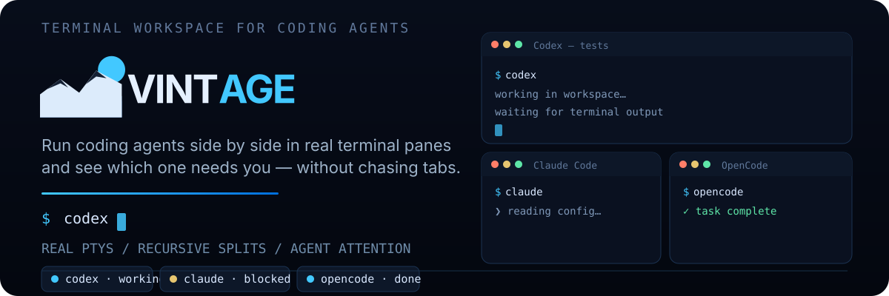

<p align="center">
  
</p>

<p align="center">
  <strong>Visual Interface for Terminal Agents.</strong><br>
  An open-source multi-agent desktop workspace.
</p>

<p align="center">
  <strong>WindowsとLinuxで使える、オープンソースのマルチエージェント・ターミナルワークスペース。</strong>
</p>

<p align="center">
  <strong>日本語</strong> · <a href="./README.md">English</a>
</p>

<p align="center">
  <a href="https://github.com/Tomatio13/vintage/releases/latest"><strong>VINTAGEをダウンロード</strong></a> ·
  <a href="#使い始める">使い始める</a> ·
  <a href="#vintageでできること">機能</a> ·
  <a href="CONTRIBUTING.md">コントリビューション</a>
</p>

> [!WARNING]
> VINTAGEは開発初期のリリースです。機能、対応環境、保存される画面配置の情報は、今後のリリースで変更される場合があります。

> [!IMPORTANT]
> VINTAGEは独立した非公式プロジェクトです。対応するエージェントCLIの開発元とは提携しておらず、承認も受けていません。

## すべてのエージェントを、ひとつの画面で

VINTAGEは、各コーディングエージェントに実ターミナルを割り当て、その活動状況をサイドバーに集約します。Grok、Codex、Claude Code、OpenCode、または任意のコマンドを並行実行し、作業中、完了、判断待ちのワークスペースへすぐに移動できます。

<p align="center">
  
</p>

## VINTAGEでできること

- **実ターミナルを使えます。** 各ペインは対話可能なシェルプロセスを持ち、設定可能なスクロールバック、入力、サイズ変更、再起動、明示的な終了に対応します。
- **並行作業を整理できます。** タブと再帰的に分割できるペインを使い、同じプロジェクトフォルダで複数のエージェントを動かせます。
- **対応が必要な作業を見つけられます。** <code>blocked</code>、<code>working</code>、<code>done</code>、<code>idle</code>の活動状態を、ペインからタブ、ワークスペースへ集約します。画面マニフェスト判定に加え、設定→Integrationsから導入したHook／Plugin報告（OpenCodeプラグインのライフサイクル、Codex／Claudeのセッション識別）が画面判定より優先されます。
- **セッション再開は開発中です。** ホスト側の再開コマンドと認証付き報告経路はありますが、ネイティブセッション再開はまだエンドツーエンドで対応していません。
- **作業ファイルをその場で確認できます。** 更新を監視するファイルツリーから、テキスト、ソースコード、画像、PDF、フォントをプレビューできます。
- **配置だけを復元します。** ワークスペース、タブ、分割、ペイン定義は保存しますが、コマンドを無断で再実行することはありません。
- **アプリ内で更新できます。** GitHub Releasesで配布される署名付き更新ファイルを、デスクトップアプリからインストールできます。

## 現在の対応状況

| 項目 | 対応内容 |
| --- | --- |
| ワークスペース | 登録したプロジェクトフォルダをターミナル操作とファイル操作の起点に使用。登録解除しても実ファイルは削除しない |
| ターミナル | 設定可能なスクロールバック、タブ、縦横の再帰分割、境界のサイズ変更、再起動、終了 |
| シェル | PowerShell 5.1／7、Git Bash、Ubuntuの既定シェル、Bash、Zsh、Git Bash／Bash／Zshの高速起動、検証済みのカスタム実行ファイル |
| エージェント | Grok、Codex、Claude Code、OpenCodeのプリセットと任意のプログラム |
| 活動状態 | 画面マニフェスト判定に加え、設定→Integrationsから導入したHook／Plugin報告が画面判定より優先される |
| 再開 | 新しいシェルとしての再起動は利用可能。ネイティブセッション再開は開発中 |
| ファイル | 隠しファイル表示、ファイルマネージャー操作、テキスト、画像、PDF、フォントのプレビュー |
| 画面配置 | <code>workspace-layouts.json</code>へ保存。破損時はバックアップ後に初期化可能 |
| 更新 | GitHub Releasesを使った署名付きアプリ内更新 |

現在配布しているのは、Windows x86-64版とLinux x86-64版です。

## VINTAGEをインストール

VINTAGEは、コンピューターにインストール済みのエージェントCLIを直接実行します。利用するCLIを準備してから、OSに合ったVINTAGEのパッケージをインストールしてください。

### 1. エージェントCLIを準備する

利用するエージェントを各公式手順でインストールし、<code>PATH</code>から実行できることを確認します。

```bash
grok --version      # Grok Build
codex --version     # OpenAI Codex
claude --version    # Claude Code
opencode --version  # OpenCode
```

VINTAGEはエージェントCLIを同梱せず、ログイン処理も代行しません。認証情報は各CLIが管理します。

### 2. VINTAGEをダウンロードする

公式の[GitHub Releasesページ](https://github.com/Tomatio13/vintage/releases/latest)を開き、**Assets**から環境に合ったファイルを選びます。

| OS | ダウンロードするファイル | アーキテクチャ |
| --- | --- | --- |
| Windows | <code>VINTAGE\_*_x64-setup.exe</code> | x86-64 |
| Debian／Ubuntu | <code>VINTAGE_*_amd64.deb</code> | x86-64 |
| その他のLinux | <code>VINTAGE_\*\_amd64.AppImage</code> | x86-64 |

#### Windows

<code>VINTAGE\_\*\_x64-setup.exe</code>を実行し、案内に従ってください。Windows版はアプリ内更新用に署名されていますが、Authenticodeによるコード署名はまだありません。そのため、Microsoft Defender SmartScreenに警告が表示される場合があります。続行する前に、取得元が<code>github.com/Tomatio13/vintage</code>であることを確認してください。

#### Debian／Ubuntu

```bash
sudo apt install ./VINTAGE_*_amd64.deb
```

#### その他のLinux

```bash
chmod +x VINTAGE_*_amd64.AppImage
./VINTAGE_*_amd64.AppImage
```

<code>.sig</code>、<code>.app.tar.gz</code>、<code>latest.json</code>で終わるファイルは自動更新用です。手動インストールでは必要ありません。

## 使い始める

1. サイドバーの\*\*+\*\*ボタンからプロジェクトフォルダを追加します。
1. ペインでターミナルを起動します。新しいタブでは、設定した既定のシェルが使われます。
1. ペインの操作メニューからエージェントを起動するか、ターミナルへ<code>codex</code>、<code>claude</code>、<code>opencode</code>、<code>grok</code>を直接入力します。
1. ペインを分割して作業を並行させ、サイドバーのバッジから対応が必要なエージェントを探します。
1. 右側の**Files**を開き、ワークスペースのファイルを参照、プレビューします。

分割境界はキーボードでも操作できます。<kbd>矢印</kbd>キーでサイズを変更し、<kbd>Home</kbd>／<kbd>End</kbd>で端まで移動します。<kbd>Shift</kbd>を押しながら操作すると、変更幅が細かくなります。

VINTAGEの終了時には、すべての擬似端末（PTY）、子プロセス、ファイル監視、Hook用のプロセス間通信（IPC）を停止します。保存するのは画面配置だけで、プロセスを無断で再実行することはありません。

### シェルのプロンプト表示を速くする

**設定 → Application → Default shell**で選択してから、新しいターミナルを作成します。対応するシェルが検出されている場合は、次の高速起動を選べます。

- **Git Bash (fast startup)**と**Bash (fast startup)**は、<code>--noprofile --norc</code>でプロファイルとrcファイルを読み込みません。
- **Zsh (fast startup)**は、<code>zsh -f</code>でZshの起動ファイルの大半を読み込みません。

高速起動は、低スペック端末やプロンプトプラグインが多い環境に向いています。読み込まない設定に含まれるエイリアス、テーマ、言語バージョン管理ツールなどは利用できません。既存のシェル設定は変更されないため、必要なときは通常のシェルへ戻せます。

## 仕組み

```text
Reactレンダラー
      │ 型付けされたTauriコマンドとイベント
      ▼
Tauri Rustホスト
      │ PTYとHook IPC環境
      ▼
エージェントCLIを実行するシェルプロセス
```

Reactレンダラーは、プロセスの起動やファイルシステムへの直接アクセスを行いません。シェル検出、実行ファイルの検証、PTYの生成と終了、ワークスペース登録、ファイル監視、プレビューをRustホストが担当します。Hook／Plugin連携の基盤も、ローカルIPCサーバー、トークン検証、資産管理をすべてRustホストに置いています。

各ペインは、検出済みのシェルを実行する実際のPTYです。エージェントはそのシェル内で起動し、終了後は同じシェルへ戻ります。ペインごとの世代番号を使い、以前の起動に属する古いイベントを破棄します。

- PTY状態（starting／running／stopped／exited／error）は、プロセスの稼働状況を表します。
- エージェント活動状態（unknown／idle／working／blocked／done）は、ターミナル末尾の画面判定と、設定→Integrationsから導入したHook／Plugin報告を組み合わせて決まります。OpenCodeプラグインの報告は画面判定より優先され、Codex／ClaudeのHookはネイティブセッションIDを報告し、サイドバーのペイン行に表示されます。

画面配置は<code>workspace-layouts.json</code>へ保存します。一方で、PTY ID、スクロールバック、Hookトークン、プロンプトなどの実行状態は保存しません。

詳しいレイヤー構成、信頼境界、永続化モデルは、[アーキテクチャガイド](docs/architecture.md)で説明しています。

## エージェントHookの設定（Integrations）

VINTAGEはエージェントの活動状態を2つの情報源から読み取ります。**画面マニフェスト判定**（常時有効）と、任意で**Hook／Plugin報告**（エージェントCLI自身が送る通知）です。報告は画面判定より優先され、エージェントのネイティブセッションIDも届き、サイドバーのペイン行に表示されます。

報告を有効にするには、**設定→Integrations** から各エージェントの管理資産をインストールします。各エージェントに Install／Uninstall ボタンと状態表示があります。

| エージェント | 配置される資産 | 追記される設定 |
| --- | --- | --- |
| Codex | `~/.codex/vintage-agent-state.sh`（または `.ps1`） | `~/.codex/hooks.json` の `hooks.SessionStart` ＋ `~/.codex/config.toml` の `[features] hooks = true` |
| Claude Code | `~/.claude/hooks/vintage-agent-state.sh`（または `.ps1`） | `~/.claude/settings.json` の `hooks.SessionStart`（matcher `*`） |
| OpenCode | `~/.config/opencode/plugins/vintage-agent-state.js` | なし（プラグイン自動ロード） |

VINTAGEは自分が追加したエントリだけを追加・更新・削除します（管理コマンドは末尾に `# vintage:codex`／`# vintage:claude` という印が付きます）。既存のHook、プラグイン、設定、資格情報は変更しません。VINTAGE管理外の同名ファイルがある場合は **Conflict** と表示され、上書きも削除もしません。

インストール後、ペイン内でエージェントの**新しい対話セッションを開始**してください（Hookはセッション開始時に実行されます）。するとサイドバーのペイン行にネイティブセッションIDが表示されます。報告を止めるには **Uninstall** を押します。管理エントリとスクリプトだけが削除され、あなたの設定は保持されます。

> **注意:** Codexの`codex exec`（非対話）モードでは `SessionStart` Hookは実行されません。セッションIDを見るには対話セッションを使ってください。OpenCodeのプラグインは `opencode run` でも動作します。

## プライバシーとセキュリティ

- VINTAGEは、エージェントの認証情報やブラウザー認証トークンを読み取ったり保存したりしません。
- ターミナル出力、プロンプト、ソースコードの内容は永続化せず、アプリケーションログにも出力しません。
- プレビュー時の読み込み上限は、テキスト512 KiB、フォント8 MiB、対応する画像とPDFは20 MiBです。
- ターミナルで入力したコマンドは、ローカルシェルと同じ権限で実行されます。
- Hook IPCトークンは一度だけホストへ渡し、ログや永続ストレージには保存しません。
- ローカルプロセスとファイル操作は、ReactレンダラーではなくTauri Rustホストから開始します。
- ワークスペースの登録を解除しても、実際のディレクトリやファイルは削除しません。
- エージェントCLIや接続先サービスは、VINTAGEとは別にセッション情報を保存する場合があります。

## 開発

必要な環境：

- Node.js 24以降
- pnpm 11
- Rust 1.88以降
- 手動テストに使用するエージェントCLI

```bash
git clone https://github.com/Tomatio13/vintage.git
cd vintage
pnpm install
pnpm tauri dev
```

レンダラーだけを確認する場合は、<code>pnpm dev</code>を実行します。

### 技術スタック

- Tauri 2とRust
- React 19、TypeScript、Vite
- RustホストのPTY上で動くghostty-web
- Tauriコマンドとイベントを集約する、型付けされたホストファサード
- Node.jsテストランナーで検証する、純粋なTypeScriptのワークスペースモデル

### 検証

```bash
pnpm check
cargo fmt --manifest-path src-tauri/Cargo.toml --check
```

<code>pnpm check</code>は、フロントエンドの型検査とビルド、画面設定、ワークスペース、エージェント状態、Rustのテスト、<code>cargo check</code>を順に実行します。

## コントリビューション

まず[GitHub Issue](https://github.com/Tomatio13/vintage/issues/new/choose)を作成し、[CONTRIBUTING.md](CONTRIBUTING.md)を確認してください。メンテナーがIssueを受理し、実装範囲に合意する前に、プルリクエストを作成しないでください。

実装を依頼された場合は<code>develop</code>からブランチを作り、合意した変更だけを含めて検証を実行し、<code>develop</code>宛てにプルリクエストを作成します。

## メンテナー向けリリース手順

<details>
<summary>リリースをビルドして公開する</summary>

1. <code>package.json</code>、<code>src-tauri/Cargo.toml</code>、<code>src-tauri/tauri.conf.json</code>のバージョンを更新します。
1. レビュー済みのプルリクエストで<code>develop</code>を<code>main</code>へマージするか、<code>main</code>から**Release**ワークフローを手動実行します。
1. 下書きのGitHub Releaseに生成されたWindows NSIS、Linux AppImage、Debianパッケージを対象OSでテストします。
1. <code>.sig</code>ファイルと<code>latest.json</code>がアップデーター用ファイルと一致することを確認します。
1. すべての確認後に下書きを公開します。

ワークフローには<code>TAURI_SIGNING_PRIVATE_KEY</code>が必要です。鍵にパスワードを設定している場合は、<code>TAURI_SIGNING_PRIVATE_KEY_PASSWORD</code>も登録します。秘密鍵はリポジトリの外で保管してください。

</details>

## ライセンス

VINTAGEは[MIT License](LICENSE)で公開しています。
